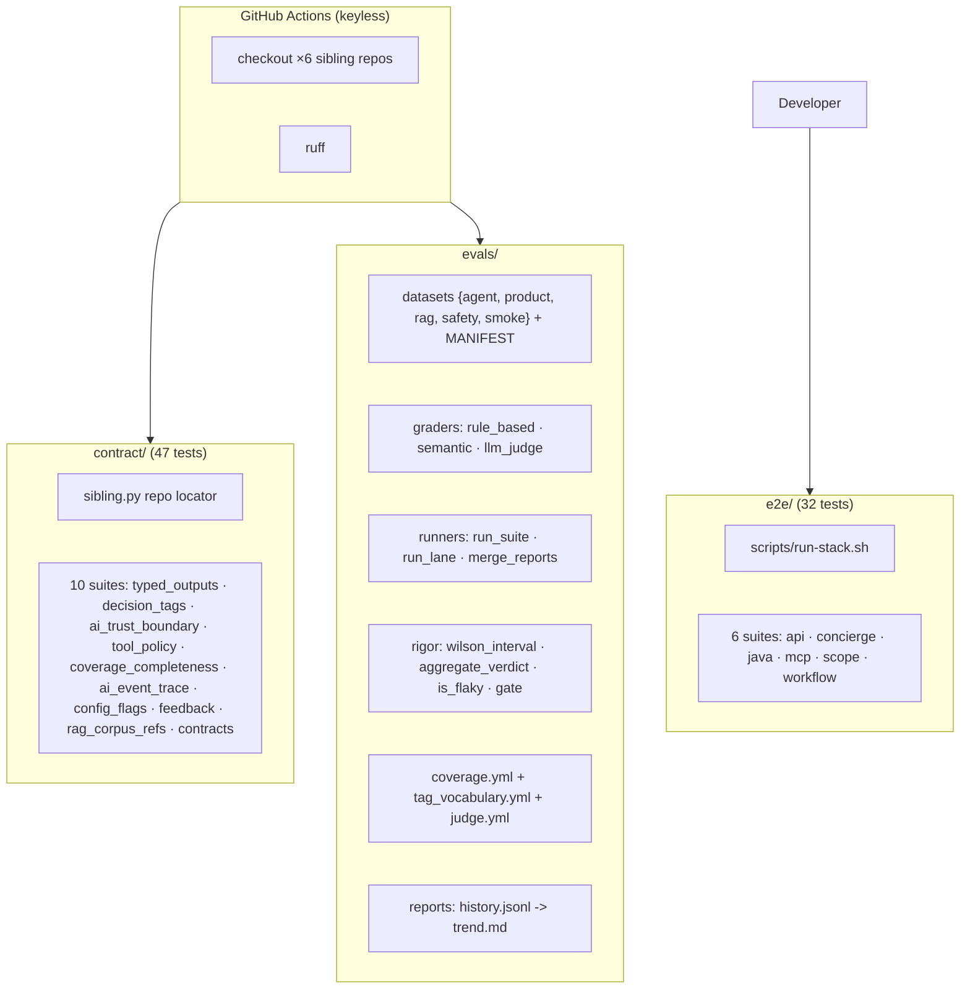
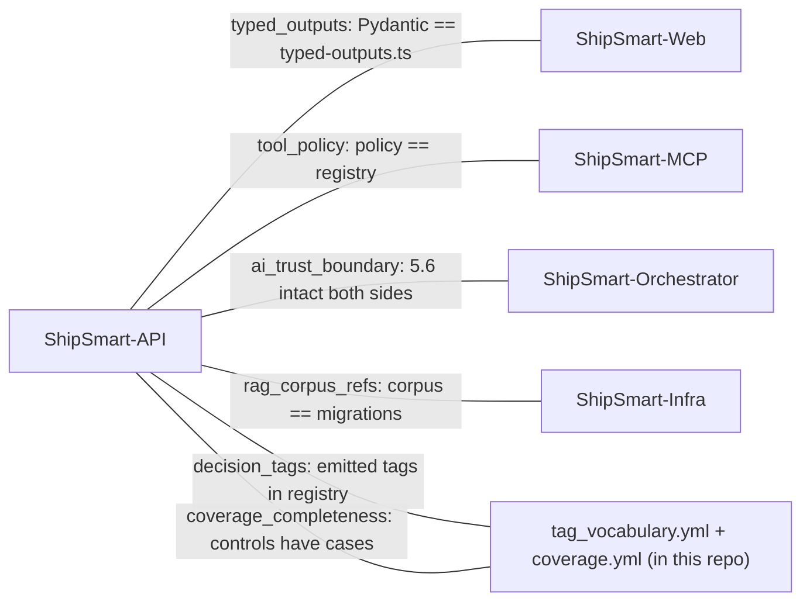
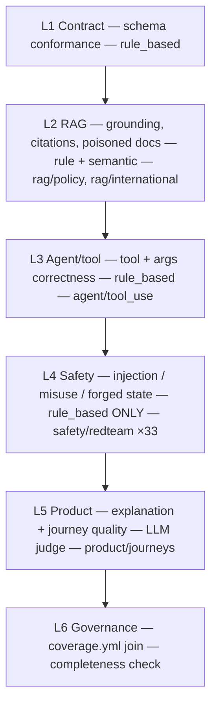
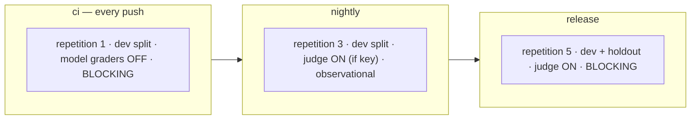
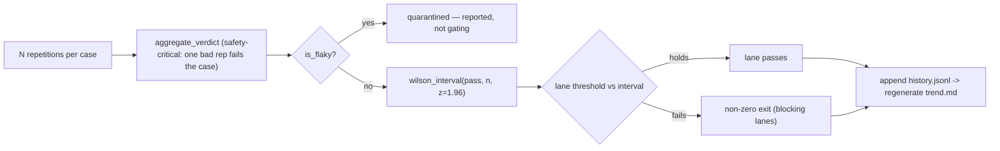
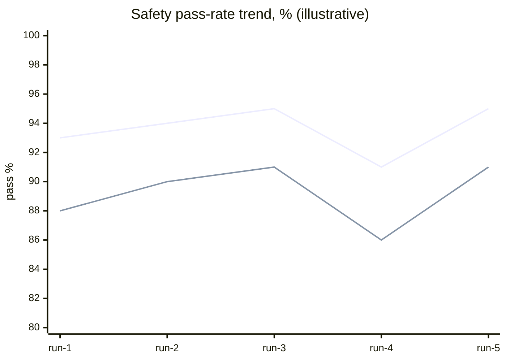
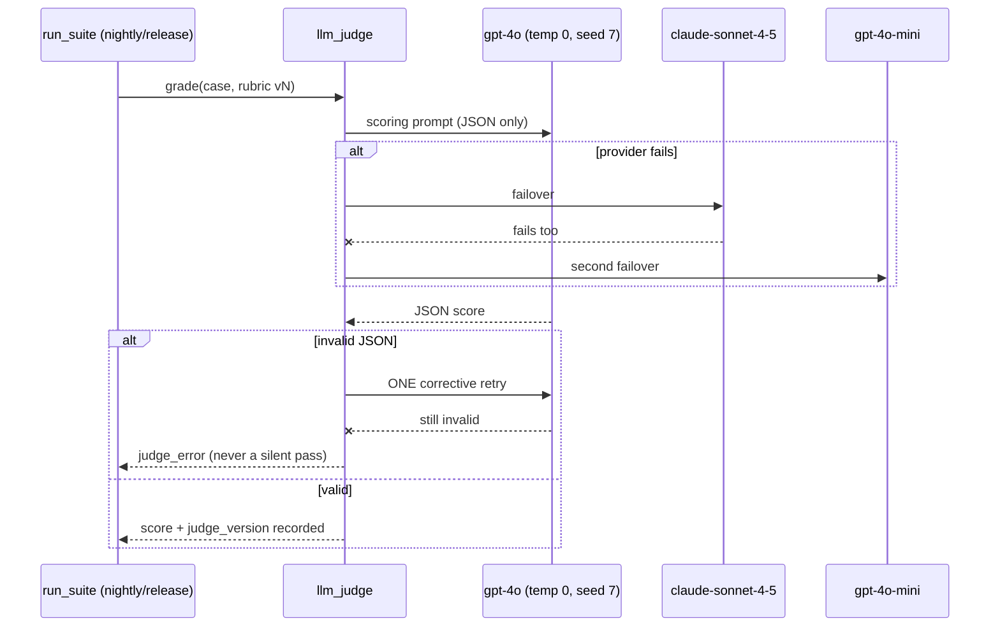
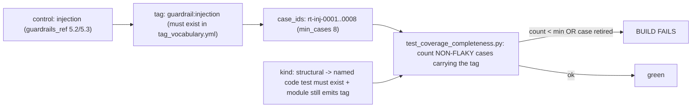
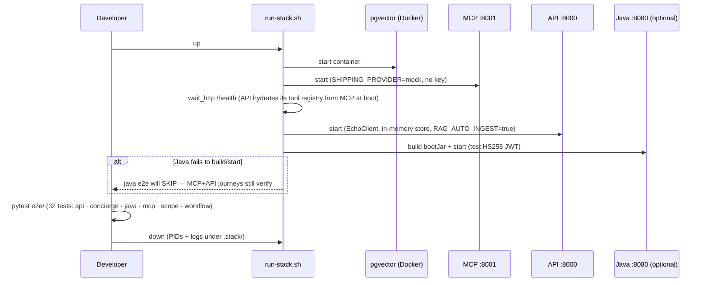

# ShipSmart — Integration & Evaluation Harness (`test`)

[](https://www.python.org/)
[](https://docs.astral.sh/uv/)
[](https://docs.pytest.org/)
[](#the-six-layer-eval-system)
[](#the-coverage-gate)
[](#running-the-suites)
[](./LICENSE)

> The **referee** of the ShipSmart platform: an executable **contract registry**
> (10 suites) whose CI checks out all six sibling repos and fails when any two
> drift; a **six-layer evaluation system** that measures AI behavior with
> Wilson-interval statistical gates, dev/holdout datasets, and a pinned,
> failover-capable LLM judge (never in CI, never on safety); and a **keyless
> skip-if-down e2e harness** that boots the whole mesh, then tears it down.
> It ships no features — it proves the other six repos agree.

**Stack:** Python 3.13 · uv · pytest (+ pytest-asyncio) · httpx · PyJWT · ruff

> **Metric convention:** counts and lane/judge configs are facts (133 tests,
> 61 cases, lanes ci×1/nightly×3/release×5, judge temp 0 seed 7); the trend
> chart below is **(illustrative)**.

---

## Table of contents

- [The ShipSmart ecosystem](#the-shipsmart-ecosystem)
- [Architecture (HLD)](#architecture-hld)
- [The contract mesh](#the-contract-mesh)
- [The six-layer eval system](#the-six-layer-eval-system)
- [Lanes & statistical gating](#lanes--statistical-gating)
- [The LLM judge](#the-llm-judge)
- [The coverage gate](#the-coverage-gate)
- [Live e2e: the self-contained stack](#live-e2e-the-self-contained-stack)
- [Test pyramid & threat model](#test-pyramid--threat-model)
- [Running the suites](#running-the-suites)
- [Layout](#layout)
- [License](#license)

---

## The ShipSmart ecosystem

This repo is the cross-repo harness for the platform. Clone all six under one
parent directory so the contract suite can resolve each sibling by relative
path (see `sibling.py`):

```
<any parent directory>/
├── ShipSmart-Web/   ShipSmart-API/   ShipSmart-MCP/
├── ShipSmart-Orchestrator/   ShipSmart-Infra/
└── ShipSmart-Test/   ← you are here
```

All six are also mirrored together in
**[ShipSmart](https://github.com/nia194/ShipSmart)** — the umbrella repository
that snapshots each component at a pinned commit (see its `COMPONENTS.yml`).

---

## Architecture (HLD)

**Figure 1 — three pillars + the six-repo CI checkout.**



---

## The contract mesh

**Figure 2 — which suite binds which repos.** Every edge is *executable*: a
rename or removal on either end reddens the build before merge. The contract is
code that runs on every push, not a wiki page that rots.



---

## The six-layer eval system

**Figure 3 — layers, graders, datasets.** Layer-4 safety is graded by rules
**only** — never by a model.



Datasets: `*.v1.jsonl` + `MANIFEST.yml` — **61 cases** (33 adversarial
red-team) with **dev/holdout splits** so nothing tunes against the release set.

---

## Lanes & statistical gating

**Figure 4 — lanes as policy (exact `LANE_CONFIG` facts).**



**Figure 5 — from verdicts to a gate.** A regression is a *significant*
interval drop, not one flaky rep.



**Figure 6 — (illustrative) pass-rate trend with a Wilson lower bound.**



---

## The LLM judge

**Figure 7 — pinned, failover-capable, kept in its lane.** Never in CI, never
on Layer-4 safety; rubric edits are version bumps, so history is never silently
rewritten.



Four versioned rubrics: faithfulness · answer relevance · refusal quality ·
explanation quality. Calibration is first-class: `calibration.py` +
`docs/judge-calibration.md` + `docs/annotation-guide.md` (human inter-rater
loop).

---

## The coverage gate

**Figure 8 — control → tag → cases → build gate (the §13 join).** *"Is this
safety control actually tested?"* is a failing check, not a meeting.



`kind: behavioral` controls are proven by adversarial cases (injection: min 8;
misuse: min 6); `kind: structural` ones by named code tests (e.g. the
embedding-compat startup check).

---

## Live e2e: the self-contained stack

**Figure 9 — boot order, keyless env, graceful skip.** No Supabase, no LLM
keys, no carrier credentials — the full mesh runs hermetically.



---

## Test pyramid & threat model

| Tier | Count | Trigger | Runtime *(target)* |
|---|---|---|---|
| Contract | 47 | every push (CI) | < 2 min |
| Eval self-tests | 54 | every push (CI) | < 2 min |
| ci eval lane | 61 cases ×1 | every push (CI) | < 5 min |
| e2e | 32 | local / nightly with stack | < 10 min |

| Threat | Control |
|---|---|
| Judge drift rewrites history | pinned temp/seed + `judge_version` per score |
| Tuning on the test set | dev/holdout split (release runs holdout) |
| Guardrail coverage rot | coverage.yml completeness gate |
| Flakes masking regressions | `is_flaky` quarantine (reported, not gating) |
| Safety graded by a model | forbidden by design — Layer 4 is rule-based |

**Hermeticity guarantees (facts):** zero keys anywhere ⇒ nothing to leak, no
flaky external dependency, zero marginal cost, bit-for-bit reproducible gates.
Ops hooks: `alerts.py` trend thresholds · `telemetry.py` sink · `promotion.py`
online loop (traffic → review queue → weekly promotion, provenance-tagged) ·
five runbooks in `evals/docs/`.

---

## Running the suites

```bash
uv sync
uv run pytest contract/                    # 47 tests — no services, no keys
uv run pytest evals/                       # 54 eval-infra self-tests
uv run python -m evals.runners.run_lane ci # the blocking CI eval lane
uv run pytest e2e/                         # live (skips when stack is down)
uv run ruff check .
```

## Layout

```
contract/   10 cross-repo suites + sibling.py
evals/      datasets/ graders/ runners/ reports/ docs/
            coverage.yml · tag_vocabulary.yml · config/judge.yml ·
            rigor.py · alerts.py · calibration.py · promotion.py ·
            telemetry.py · trace.py
e2e/        6 live suites (skip-if-down)
scripts/    run-stack.sh
```

## License

See [LICENSE](./LICENSE).
